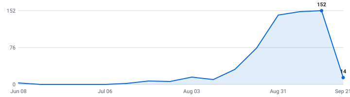

# 🎓 Summer 2027 Tech Internships

**A self-updating engine that tracks tech internships so you don't have to.**

&nbsp;&nbsp;&nbsp;

### 202 open roles (163 listed below) · 202 new this week

4,414 employers tracked · data as of Sep 03, 2026 at 18:17 UTC

_57 have a cycle the employer stated · 145 are recent postings whose cycle isn't stated (listed separately, never mixed in)._

**[🖥️ Live dashboard](https://harshaprakash1.github.io/Automated-List-Of-Spring-2027-Tech-Internships/)** · **[📡 RSS](https://harshaprakash1.github.io/Automated-List-Of-Spring-2027-Tech-Internships/feed.xml)** · **[⚙️ JSON API](https://harshaprakash1.github.io/Automated-List-Of-Spring-2027-Tech-Internships/api/jobs.json)** · **[✉️ Email alerts](https://harshaprakash1.github.io/Automated-List-Of-Spring-2027-Tech-Internships/#subscribe)**

> [!TIP]
> **⭐ Star this repo** to save it and get updates when new roles are added.

Instead of refreshing a dozen career pages by hand, it reads company hiring feeds directly and keeps one live list — newest roles on top, refreshed automatically throughout the day.

**🔔 New roles in your inbox:** [subscribe by email](https://harshaprakash1.github.io/Automated-List-Of-Spring-2027-Tech-Internships/#subscribe) - one email a day, only when new internships actually appeared, unsubscribe from any email in two clicks. (Prefer RSS-to-email? [Feedrabbit works too](https://feedrabbit.com/subscriptions/new?url=https%3A%2F%2Fraw.githubusercontent.com%2FHarshaPrakash1%2FAutomated-List-Of-Spring-2027-Tech-Internships%2Fmain%2Fdocs%2Ffeed.xml).)

---

## What this is

This is an engine, not a hand-kept list. It polls company career feeds every 30 minutes, finds the internships, removes duplicates, and rebuilds this page on its own.

Every link comes straight from the source — so it's real and current, not a stale list someone forgot to update. Speed matters.

## What makes this different

| | |
|---|---|
| 📅 **[Drop Radar](#drop-radar)** | A forecast of **what's coming**. Each marquee company's typical opening window, replaced by the real drop date the moment the engine catches it live. Windows are estimates and labelled as such; only dates the engine saw itself are marked verified. |
| 🛂 **Visa intel, computed** | 🇺🇸 / 🛂 flags detected automatically from every job description, plus ✓ for employers with a real H-1B track record (USCIS data, FY2022-23 — a history, not a promise). The big lists crowdsource this by hand; here it's code. Most postings say nothing either way, and those show as unknown rather than guessed. |
| 📆 **A real date on nearly every role** | Taken from the job portal itself wherever the portal states one, so newest-first actually means newest. The exact coverage figure is printed at the bottom of this page every run. |
| 🧰 **Skill tags + pay, extracted** | Every posting's text is scanned for the stack it wants (Python, C++, PyTorch, …) and the pay it states — searchable on the [dashboard](https://harshaprakash1.github.io/Automated-List-Of-Spring-2027-Tech-Internships/), and included in the CSV and API. |
| 🔔 **Alerts your way** | [Email digests](https://harshaprakash1.github.io/Automated-List-Of-Spring-2027-Tech-Internships/#subscribe) or [RSS](https://harshaprakash1.github.io/Automated-List-Of-Spring-2027-Tech-Internships/feed.xml) — point any reader, or a Slack/Discord RSS integration, at it. Plus a [live dashboard](https://harshaprakash1.github.io/Automated-List-Of-Spring-2027-Tech-Internships/) with search, filters, and a saved-roles list that never leaves your browser. |
| ⚙️ **An engine, not a spreadsheet** | 4,661 job-board endpoints (4,414 distinct employers; some run more than one board) polled every 30 minutes across 12 ATS platforms. Full source and tests in this repo. |

## Scope

| | |
|---|---|
| **Roles** | Software Engineering, Data Science & Machine Learning (and closely related technical internships) |
| **Region** | United States |
| **Cycles** | Spring 2027 |

## About

I'm an international student studying in the United States, so I built this for the search I'm doing myself. The list is US roles only for now — that's where I'm searching.

Use it to spot roles early and apply before they fill up. Being first genuinely helps.

## Where this is going

I'm building this in the open and adding to it as it grows.

**Recently shipped:** email alerts · the Drop Radar · auto-detected sponsorship flags · the live dashboard

**Next up:** personalized alerts (pick your categories) · per-company hiring pages · a ghost-posting detector

If it helps you, a star means a lot and tells me to keep going.

## How to use

<b>Reading the table — flags, dates, and the cycle split</b> (click to expand)

- Roles are grouped by cycle below - **newest posting on top, oldest at the bottom.**
- A cycle section holds only roles whose **employer stated that cycle** - in the title, or in the posting's own text. Postings that name no cycle anywhere are in *Recently posted — cycle not stated* further down, with **no cycle guessed for them**. Same quality bar, different amount of evidence.
- The **Posted** column is the date the company published the role.
- **_(3 openings)_ after a role title** = the employer has that many separate live requisitions for the same job, in the same place, for the same cycle. They're all real and each takes its own application, so they're linked individually (**Apply**, then **#2**, **#3**) instead of repeating the row. Counts still count requisitions, and the CSV export is never grouped.
- **🆁 after a company name** = **this role is remote** — the posting's own location or title says so. It marks the role on that row, not the whole company.
- **Flags after a role title:** 🇺🇸 = requires U.S. citizenship or a security clearance · 🛂 = the posting says it won't sponsor a work visa · 🆕 = spotted in the last 48 hours. Sponsorship flags are detected automatically from each job description - treat them as a strong hint and confirm on the posting.
- **✓ after a company name** = a real H-1B track record: USCIS approved 10+ petitions for that employer in FY2022–2023 (matched automatically against the official [H-1B Employer Data Hub](https://www.uscis.gov/tools/reports-and-studies/h-1b-employer-data-hub)). No ✓ doesn't mean they won't sponsor - it means we can't prove they have.
- Track your applications with [`data/internships.csv`](data/internships.csv) (opens in Excel / Google Sheets).
- Missing a company? Adding one takes a single line, see [CONTRIBUTING.md](CONTRIBUTING.md).

---

## Spring 2027  (47 employer-stated)

| Company | Role | Category | Location | Skills | Posted | Apply |
|---|---|---|---|---|---|---|
| Hermeus | Software Engineering Intern (Command & Control) - Spring/Summer 2027 🇺🇸 🆕 | Software | Atlanta, GA | C++, TypeScript, JavaScript, React | Sep 03, 2026 | [Apply](https://jobs.lever.co/hermeus/5b08e2df-c9db-4831-aece-67d89e744796) |
| RTX | Software Engineering Co-op (Winter/Spring 2027) 🛂 🆕 | Software | US-IA-CEDAR RAPIDS-105 ~ 400 Collins Rd… | Python, C++ | Sep 02, 2026 | [Apply](https://globalhr.wd5.myworkdayjobs.com/rec_rtx_ext_gateway/job/US-IA-CEDAR-RAPIDS-105--400-Collins-Rd-NE--BLDG-105/Software-Engineering-Co-op--Winter-Spring-2027-_01870191) |
| Lego | Firmware Engineering Co-Op - Spring 2027 🆕 | Hardware | United States of America | Python | Sep 02, 2026 | [Apply](https://lego.wd103.myworkdayjobs.com/lego_executive/job/Boston-Hub/Firmware-Engineering-Co-Op---Spring-2027_0000037765) |
| Northrop Grumman | 2027 Software Engineer Intern - Linthicum Maryland 🇺🇸 🆕 | Software | United States-Maryland-Linthicum | No skills listed | Sep 02, 2026 | [Apply](https://ngc.wd1.myworkdayjobs.com/Northrop_Grumman_External_Site/job/United-States-Maryland-Linthicum/XMLNAME-2027-Software-Engineer-Intern---Linthicum-Maryland_R10248910) |
| CACI | Embedded Software Engineering Co-op - Spring 2027 🆕 | Software | Danbury, CT, US | Python, C++, C#, Linux | Sep 01, 2026 | [Apply](https://caci.wd1.myworkdayjobs.com/external/job/Danbury-CT-US/Embedded-Software-Engineering-Co-op---Spring-2027_331368) |
| Hermeus | Software Engineering Intern (Modeling & Simulation) - Spring/Summer 2027 🇺🇸 🆕 | Software | Los Angeles, CA | Python, C++, MATLAB | Sep 01, 2026 | [Apply](https://jobs.lever.co/hermeus/445db430-6f81-41cf-847a-56a947afb936) |
| Hermeus | Software Engineering Intern (HIL) - Spring/Summer 2027 🇺🇸 🆕 | Software | Atlanta, GA | Python, C++, MATLAB | Sep 01, 2026 | [Apply](https://jobs.lever.co/hermeus/d87ed913-affc-475e-b721-c5b5f11c3c7b) |
| Fifth Third Bank | Software Engineer Co-Op - Enterprise Finance Applications - Spring 2027 🆕 | Software | Cincinnati, OH | Java, LLMs, Node.js, Angular | Sep 01, 2026 | [Apply](https://fifththird.wd5.myworkdayjobs.com/53careers/job/Cincinnati-OH/Software-Engineer-Co-Op---Enterprise-Finance-Applications---Spring-2027_R71587) |
| CACI | Software Engineering Co-op - Spring & Summer 2027 🆕 | Software | Danbury, CT, US | Python, Java, C++, C# | Aug 31, 2026 | [Apply](https://caci.wd1.myworkdayjobs.com/external/job/Danbury-CT-US/Software-Engineering-Co-op---Spring---Summer-2027_331356-1) |
| CIBC | 2027 Spring Term Software Engineer Co-op - Chicago (Northeastern University) 🛂 🆕 | Software | Chicago, IL | Python, Java, C++, C# | Aug 31, 2026 | [Apply](https://cibc.wd3.myworkdayjobs.com/search/job/Chicago-IL/XMLNAME-2027-Spring-Term-Software-Engineer-Co-op---Chicago--Northeastern-University-_2617782-1) |
| Brunswick ✓ | Software Engineering Intern 🆕 | Software | Champaign, IL | Python, C++, ROS, Unreal | Aug 28, 2026 | [Apply](https://brunswick.wd1.myworkdayjobs.com/search/job/Champaign-IL/Software-Engineering-Intern_JR-051449) |
| The Walt Disney Company | Software Engineering Intern, Spring 2027 🆕 | Software | Orlando, FL, USA | Java, C#, TypeScript, JavaScript | Aug 28, 2026 | [Apply](https://disney.wd5.myworkdayjobs.com/disneycareerdc/job/Orlando-FL-USA/Software-Engineering-Intern--Spring-2027_10158599-1) |
| Amazon ✓ | Software Development Engineer Intern, Annapurna Labs - 2027 🆕 | Software | Cupertino, California, USA | Python, Java, C++, PyTorch | Aug 27, 2026 | [Apply](https://www.amazon.jobs/en/jobs/10517567/software-development-engineer-intern-annapurna-labs-2027) |
| AbbVie ✓ | 2027 Business Technology Solutions Intern - Cybersecurity (Undergraduate) 🆕 | Security | North Chicago +2 more | Python, Java, C#, JavaScript | Aug 27, 2026 | [Apply](https://jobs.smartrecruiters.com/AbbVie/3743990014896329) |
| AbbVie ✓ | 2027 Business Technology Solutions Intern - Cybersecurity (Undergraduate) 🆕 | Security | Irvine, CA, United States (Hybrid) | Python, Java, C#, JavaScript | Aug 27, 2026 | [Apply](https://jobs.smartrecruiters.com/AbbVie/3743990014900496) |
| AbbVie ✓ | 2027 Business Technology Solutions Intern - Cybersecurity (Undergraduate) 🆕 | Security | South San Francisco +2 more | Python, Java, C#, JavaScript | Aug 27, 2026 | [Apply](https://jobs.smartrecruiters.com/AbbVie/3743990014900536) |
| CNO Financial Group 🆁 | Artificial Intelligence (AI) IT Intern 2027 - REMOTE 🆕 | Data & ML/AI | Carmel, IN | No skills listed | Aug 27, 2026 | [Apply](https://cnoinc.wd5.myworkdayjobs.com/Careers/job/Carmel-IN/Artificial-Intelligence--AI--IT-Intern-2027---REMOTE_JR170389) |
| Verkada ✓ | Backend Software Engineering Intern 2027 🆕 | Software | San Mateo, CA United States | Python, Go, Computer Vision, AWS | Aug 25, 2026 | [Apply](https://job-boards.greenhouse.io/verkada/jobs/5210813007) |
| Verkada ✓ | Frontend Software Engineering Intern 2027 🆕 | Software | San Mateo, CA United States | TypeScript, JavaScript, React, Angular | Aug 25, 2026 | [Apply](https://job-boards.greenhouse.io/verkada/jobs/5210942007) |
| Verkada ✓ | Embedded Software Engineering Intern 2027 🆕 | Software | San Mateo, CA United States | C++, Linux | Aug 25, 2026 | [Apply](https://job-boards.greenhouse.io/verkada/jobs/5211595007) |
| DTCC | Application Developer Intern [2027 Intern Program] 🆕 | Software | Jersey City +8 more | Python, Java, TypeScript, JavaScript | Aug 25, 2026 | [Apply](https://ebxr.fa.us2.oraclecloud.com/hcmUI/CandidateExperience/en/sites/CX_1/job/214459) |
| DTCC | Infrastructure Engineer Intern [2027 Intern Program] 🆕 | Software | Jersey City +8 more | Python, SQL, Bash, AWS | Aug 25, 2026 | [Apply](https://ebxr.fa.us2.oraclecloud.com/hcmUI/CandidateExperience/en/sites/CX_1/job/214473) |
| DTCC | Information Security Intern [2027 Intern Program] 🆕 | Security | Jersey City +8 more | No skills listed | Aug 25, 2026 | [Apply](https://ebxr.fa.us2.oraclecloud.com/hcmUI/CandidateExperience/en/sites/CX_1/job/214476) |
| The Walt Disney Company | WDW Computer Science / Computer Engineering Interns, Spring 2027 🆕 | Software | Lake Buena Vista, FL, USA | Python, C++, C#, SQL | Aug 24, 2026 | [Apply](https://disney.wd5.myworkdayjobs.com/disneycareerdc/job/Lake-Buena-Vista-FL-USA/WDW-Computer-Science---Computer-Engineering-Interns--Spring-2027_10158145-1) |
| Fifth Third Bank | Information Security Co-op – Code Security – Spring 2027 🆕 | Security | Cincinnati, OH | Python, JavaScript, AWS | Aug 20, 2026 | [Apply](https://fifththird.wd5.myworkdayjobs.com/53careers/job/Cincinnati-OH/Information-Security-Co-op---Code-Security---Spring-2027_R71575) |
| Fifth Third Bank | Information Security Co-op – Identity & Access Management – Spring 2027 🆕 | Security | Cincinnati, OH | Linux | Aug 20, 2026 | [Apply](https://fifththird.wd5.myworkdayjobs.com/53careers/job/Cincinnati-OH/Information-Security-Co-op---Identity---Access-Management---Spring-2027_R71590) |
| Mosaic | Artificial Intelligence Co-Op/Intern - Spring 2027 🆕 | Data & ML/AI | US - Tampa, FL (Lithia area) | Python, PyTorch, TensorFlow, scikit-learn | Aug 20, 2026 | [Apply](https://mosaic.wd5.myworkdayjobs.com/mosaic/job/US---Tampa-FL-Lithia-area/Artificial-Intelligence-Co-Op-Intern---Spring-2027_64729) |
| The Nuclear Company | Spring 2027 AI Applied Research Internship 🇺🇸 🆕 | Data & ML/AI | Washington, DC | Python, SQL, scikit-learn, Pandas | Aug 14, 2026 | [Apply](https://job-boards.greenhouse.io/thenuclearcompany/jobs/5391888008) |
| Ameren | Cybersecurity Co-Op 🆕 | Security | St. Louis, MO | No skills listed | Aug 10, 2026 | [Apply](https://ameren.wd1.myworkdayjobs.com/External/job/St-Louis-MO/Cybersecurity-Co-Op_033868-1) |
| Axon | 2027 US Firmware Engineering Internship 🆕 | Hardware | Seattle, Washington, United States | Python, C++, Go, Rust | Aug 07, 2026 | [Apply](https://job-boards.greenhouse.io/axontalentcommunity/jobs/7837246003) |
| The Nuclear Company | Spring 2027 Software Engineering Intern 🇺🇸 🆕 | Software | Washington, DC | Python, Java, C++, Rust | Aug 07, 2026 | [Apply](https://job-boards.greenhouse.io/thenuclearcompany/jobs/5383171008) |
| The Nuclear Company | Spring 2027 AI/ML Engineering Intern 🇺🇸 🆕 | Data & ML/AI | Washington, DC | Python, PyTorch, LLMs, AWS | Aug 07, 2026 | [Apply](https://job-boards.greenhouse.io/thenuclearcompany/jobs/5383212008) |
| Varda Space | Cybersecurity Internship - Spring 2027 🇺🇸 🆕 | Security | El Segundo, California, United States | Python, Bash | Aug 07, 2026 | [Apply](https://job-boards.greenhouse.io/vardaspace/jobs/7824766003) |
| Varda Space | Site Reliability Internship - Spring 2027 🇺🇸 🆕 | Other | El Segundo, California, United States | Python, AWS, GCP, Azure | Aug 07, 2026 | [Apply](https://job-boards.greenhouse.io/vardaspace/jobs/7824814003) |
| Varda Space | Flight Software Internship - Spring 2027 🇺🇸 🆕 | Software | El Segundo, California, United States | Python, C++, Linux | Aug 07, 2026 | [Apply](https://job-boards.greenhouse.io/vardaspace/jobs/7824815003) |
| Heliux | Software Engineer (Internship, Spring 2027) 🆕 | Software | HQ (San Francisco, CA) | Python, Java, Rust, TypeScript | Jul 31, 2026 | [Apply](https://jobs.ashbyhq.com/heliux/c71c0650-b6f7-491f-b291-6b280f58ee9c) |
| Melius | Software Engineering Intern [Spring/Summer 2027] 🆕 | Software | New York City | TypeScript, LLMs, React, Next.js | Jul 31, 2026 | [Apply](https://jobs.ashbyhq.com/melius/b61f063a-4f94-4e50-a4ef-05aaab552280) |
| Virtu Financial | 2027 Internship - Frontend Engineer (UI) 🆕 | Software | New York | Python, Java, C++, TypeScript | Jul 29, 2026 | [Apply](https://job-boards.greenhouse.io/virtu/jobs/8657500002) |
| Rendezvous Robotics | Software Engineering Intern (Spring 2027) 🆕 | Software | Golden, CO | Python, C++, Linux | Jul 22, 2026 | [Apply](https://job-boards.greenhouse.io/rendezvousrobotics/jobs/4329122009) |
| Virtu Financial | 2027 Internship - Quantitative Trading 🆕 | Quant | Austin, TX; Chicago; New York | Python, Java, C++, SQL | Jul 21, 2026 | [Apply](https://job-boards.greenhouse.io/virtu/jobs/8624408002) |
| Old Mission Capital | Software Engineer – 2027 Internship Program (June Start) 🆕 | Software | Chicago, IL, United States | Python, C++, TypeScript | Jul 15, 2026 | [Apply](https://www.oldmissioncapital.com/careers/?gh_jid=7796180003) |
| The Trade Desk ✓ | 2027 North America Software Engineering Internship 🆕 | Software | Bellevue +5 more | No skills listed | Jul 15, 2026 | [Apply](https://job-boards.greenhouse.io/thetradedesk/jobs/5187605007) |
| Voloridge | Quantitative Developer Intern 2027 🆕 | Quant | Jupiter, FL | Python, C++, C#, SQL | Jun 11, 2026 | [Apply](https://job-boards.greenhouse.io/voloridgeinvestmentmanagement/jobs/4224862009) |
| Voloridge | Quantitative Research Intern 2027 🆕 | Quant | Jupiter, FL | Python | Jun 11, 2026 | [Apply](https://job-boards.greenhouse.io/voloridgeinvestmentmanagement/jobs/4226247009) |
| Anduril | 2027 Software Engineer Intern 🇺🇸 🆕 | Software | Atlanta +26 more | Python, Java, C++, Rust | Jun 10, 2026 | [Apply](https://boards.greenhouse.io/andurilindustries/jobs/5148079007?gh_jid=5148079007) |
| Ellipsis Labs | Software Engineer - 2027 Interns 🆕 | Software | New York, New York | Python, Java, C++, Rust | Mar 26, 2026 | [Apply](https://jobs.ashbyhq.com/ellipsislabs/02136b22-35b1-4b3d-8bef-567c3380a849) |
| Virtu Financial | 2027 Internship - Quantitative Researcher (Undergrad) 🆕 | Quant | New York | Python, C++, Pandas | Sep 12, 2025 | [Apply](https://job-boards.greenhouse.io/virtu/jobs/8142539002) |

## Recently posted — cycle not stated  (109 roles)

These postings never name a cycle — not in the title, not in the posting text — so neither do we. They're recent tech internships (posted within the last few weeks), often exactly the early drops worth applying to first; we just can't tell you which cycle they're for, and we'd rather say so than guess. The moment a posting's own text states a cycle, the role moves up into that section automatically.

| Company | Role | Category | Location | Skills | Posted | Apply |
|---|---|---|---|---|---|---|
| Corteva | R & D Intern - Computer & Data Science 🆕 | Data & ML/AI | Indianapolis, Indiana, United States | Python, AWS, GCP, Azure | Sep 03, 2026 | [Apply](https://corteva.wd5.myworkdayjobs.com/corteva/job/Indianapolis-Indiana-United-States/R---D-Intern---Computer---Data-Science_248131W) |
| Winsupply ✓ | Data Analyst Intern 🆕 | Data & ML/AI | Moraine, OH, United States | No skills listed | Sep 03, 2026 | [Apply](https://jobs.smartrecruiters.com/Winsupply1/3743990015046116) |
| Dynamic Catholic | Internship - Front-End UX Intern 🛂 🆕 | Other | Erlanger, Kentucky | JavaScript, HTML/CSS | Sep 02, 2026 | [Apply](https://jobs.lever.co/dynamiccatholic/603f082e-07c8-4b1c-ac09-8963c51229ad) |
| Dynamic Catholic | Internship - Software Developer - Commerce Cloud 🆕 | Software | Erlanger, Kentucky | JavaScript, HTML/CSS | Sep 02, 2026 | [Apply](https://jobs.lever.co/dynamiccatholic/e94fa581-892c-4958-9515-0221f862ce57) |
| Intel ✓ | Software Development Graduate Intern 🆕 | Software | US, California, Folsom | Python, C++, PyTorch, TensorFlow | Sep 02, 2026 | [Apply](https://intel.wd1.myworkdayjobs.com/external/job/US-California-Folsom/Software-Development-Graduate-Intern_JR0285451-1) |
| Reflect Orbital | Flight Software Engineering Intern 🆕 | Software | Hawthorne, CA | No skills listed | Sep 02, 2026 | [Apply](https://jobs.ashbyhq.com/reflect-orbital/d2ad1427-89aa-404d-8678-7b8e6dace5e2) |
| Reflect Orbital | Embedded Firmware Engineering Intern 🆕 | Hardware | Hawthorne, CA | Python, C++ | Sep 02, 2026 | [Apply](https://jobs.ashbyhq.com/reflect-orbital/d5ade048-5555-4a77-b002-d117254b6e6b) |
| Lawrence Livermore National Laboratory (LLNL) 🆁 | Protocol and Special Events Undergraduate AI and Digital Solutions Intern 🇺🇸 🆕 | Data & ML/AI | Livermore, CA, United States (Remote) | LLMs | Sep 02, 2026 | [Apply](https://jobs.smartrecruiters.com/LLNL/3743990015035697) |
| Hewlett Packard (HP) | Software Product Security Engineer Intern 🛂 🆕 | Security | Spring, Texas, United States of America | Python, C++, C#, TypeScript | Sep 02, 2026 | [Apply](https://hp.wd5.myworkdayjobs.com/ExternalCareerSite/job/Spring-Texas-United-States-of-America/Software-Product-Security-Engineer-Intern_UNI4744-1) |
| Genuine Parts Company ✓ | Software Engineer - QA Analyst Intern 🆕 _(2 openings)_ | Software | Birmingham, AL, USA | Java, SQL, Selenium | Sep 02, 2026 | [Apply](https://genpt.wd1.myworkdayjobs.com/Careers/job/Birmingham-AL-USA/Software-Engineer---QA-Analyst-Intern_R26_0000029235) [#2](https://genpt.wd1.myworkdayjobs.com/Careers/job/Birmingham-AL-USA/Software-Engineer---QA-Analyst-Intern_R26_0000029236) |
| Genuine Parts Company ✓ | Web Developer Intern 🆕 | Software | Birmingham, AL, USA | Java, React, Next.js, Angular | Sep 02, 2026 | [Apply](https://genpt.wd1.myworkdayjobs.com/Careers/job/Birmingham-AL-USA/Web-Developer-Intern_R26_0000029238) |
| Flagship Pioneering | Pioneering Intelligence: Agentic AI Co-Op 🆕 | Data & ML/AI | Cambridge, MA USA | Python | Sep 02, 2026 | [Apply](https://job-boards.greenhouse.io/fspco-op012325/jobs/8769080002) |
| National Information Solutions Cooperative (NISC) | Intern - Data Engineer 🆕 | Data & ML/AI | Mandan, ND | Python, Java, SQL, Scala | Sep 02, 2026 | [Apply](https://job-boards.greenhouse.io/testnisc/jobs/8167886) |
| National Information Solutions Cooperative (NISC) | Intern - Software Development 🆕 | Software | Mandan, ND | Java, TypeScript, JavaScript, Angular | Sep 02, 2026 | [Apply](https://job-boards.greenhouse.io/testnisc/jobs/8174096) |
| Sherwin-Williams ✓ | Year-Round IT Co-op, Cybersecurity 🆕 | Security | Cleveland, OH, United States | No skills listed | Sep 02, 2026 | [Apply](https://ejhp.fa.us6.oraclecloud.com/hcmUI/CandidateExperience/en/sites/CX_2/job/2622615) |
| Winsupply ✓ | Software Developer Intern 🆕 | Software | Moraine, OH, United States | Python, Java, Angular | Sep 02, 2026 | [Apply](https://jobs.smartrecruiters.com/Winsupply1/3743990015014717) |
| Magna International ✓ | Intern - Engineering Software 🆕 | Software | Southfield, Michigan, US | Python, C++, Bash, Linux | Sep 02, 2026 | [Apply](https://magna.wd3.myworkdayjobs.com/Magna/job/Southfield-Michigan-US/Intern---Engineering-Software_R00258617) |
| Stryker ✓ | Commercial Operations Software Engineering Intern - Flower Mound, TX 🆕 | Software | Flower Mound, Texas | No skills listed | Sep 02, 2026 | [Apply](https://stryker.wd1.myworkdayjobs.com/StrykerCareers/job/Flower-Mound-Texas/Commercial-Operations-Software-Engineering-Intern---Flower-Mound--TX_R572941) |
| Acumatica 🆁 | AI & Automation Intern, Office of the CFO 🆕 | Data & ML/AI | Bellevue, WA, United States (Remote) | Python, LLMs | Sep 01, 2026 | [Apply](https://jobs.smartrecruiters.com/Acumatica/744000146749696) |
| Ingredion | AI & Data Scientist Intern 🆕 | Data & ML/AI | Westchester, IL | SQL, PyTorch, TensorFlow, scikit-learn | Sep 01, 2026 | [Apply](https://ingredion.wd1.myworkdayjobs.com/IngredionCareers/job/Westchester-IL/AI---Data-Scientist-Intern_Req-40007-1) |
| Nike ✓ | NIKE, Inc. Artificial Intelligence, Data, & Machine Learning Engineering Undergraduate Internship 🆕 | Data & ML/AI | Beaverton, Oregon | Python, SQL, LLMs, Computer Vision | Sep 01, 2026 | [Apply](https://nike.wd1.myworkdayjobs.com/nke/job/Beaverton-Oregon/NIKE--Inc-Artificial-Intelligence--Data----Machine-Learning-Engineering-Undergraduate-Internship_R-91110) |
| Nike ✓ | NIKE, Inc. Software Engineering Undergraduate Internship 🆕 | Software | Beaverton, Oregon | Python, Java, C#, JavaScript | Sep 01, 2026 | [Apply](https://nike.wd1.myworkdayjobs.com/nke/job/Beaverton-Oregon/NIKE--Inc-Software-Engineering-Undergraduate-Internship_R-91111) |
| Stryker ✓ 🆁 | Data Science Intern - Remote 🆕 | Data & ML/AI | Florida, Virtual Address | Python, SQL | Sep 01, 2026 | [Apply](https://stryker.wd1.myworkdayjobs.com/StrykerCareers/job/Florida-Virtual-Address/Data-Science-Intern_R572731) |
| Tencent | AI Business Analyst Intern 🆕 | Data & ML/AI | US-California-Palo Alto | No skills listed | Sep 01, 2026 | [Apply](https://tencent.wd1.myworkdayjobs.com/Tencent_Careers/job/US-California-Palo-Alto/AI-Business-Analyst-Intern_R108039-1) |
| US Foods ✓ 🆁 | Intern – AI Automation (Hybrid: Onsite & Remote) 🛂 🆕 | Data & ML/AI | Rosemont IL | LLMs | Sep 01, 2026 | [Apply](https://usfoods.wd1.myworkdayjobs.com/usfoodscareersExternal/job/Rosemont-IL/Intern---AI-Automation--Hybrid--Onsite---Remote-_R282109) |
| US Foods ✓ 🆁 | Intern – Cybersecurity Operations (Hybrid: Onsite & Remote) 🛂 🆕 | Security | Rosemont IL | Python, Bash, Linux | Sep 01, 2026 | [Apply](https://usfoods.wd1.myworkdayjobs.com/usfoodscareersExternal/job/Rosemont-IL/Intern---Cybersecurity-Operations--Hybrid--Onsite---Remote-_R282117) |
| US Foods ✓ 🆁 | Intern – Cybersecurity Risk (Hybrid: Onsite & Remote) 🛂 🆕 | Security | Rosemont IL | No skills listed | Sep 01, 2026 | [Apply](https://usfoods.wd1.myworkdayjobs.com/usfoodscareersExternal/job/Rosemont-IL/Intern---Cybersecurity-Risk--Hybrid--Onsite---Remote-_R282118) |
| Valon | Software Engineer Intern 🆕 | Software | New York | Python, React, GCP, Kubernetes | Sep 01, 2026 | [Apply](https://jobs.ashbyhq.com/valon/b5a62c0c-823c-42dd-8cb5-e4b1455bcc64) |
| Eulerity | Backend Developer Intern 🆕 | Software | New York, New York | Java, LLMs, Git | Sep 01, 2026 | [Apply](https://job-boards.greenhouse.io/eulerity/jobs/4709040006) |
| Emerson Electric | AI Engineering Co-Op 🆕 | Data & ML/AI | Marshalltown, IA, United States | Python, LLMs, Git | Sep 01, 2026 | [Apply](https://hdjq.fa.us2.oraclecloud.com/hcmUI/CandidateExperience/en/sites/CX_1/job/26007510) |
| Emerson Electric | Software Engineering Co-Op 🆕 | Software | Marshalltown, IA, United States | Java, JavaScript, SQL, HTML/CSS | Sep 01, 2026 | [Apply](https://hdjq.fa.us2.oraclecloud.com/hcmUI/CandidateExperience/en/sites/CX_1/job/26008442) |
| Emerson Electric | Embedded Software Co-Op 🆕 | Software | Marshalltown, IA, United States | C++, C# | Sep 01, 2026 | [Apply](https://hdjq.fa.us2.oraclecloud.com/hcmUI/CandidateExperience/en/sites/CX_1/job/26008443) |
| Altera Corporation | Graduate Intern - Engineering Infrastructure 🆕 | Software | San Jose, California, United States | Python, Bash, AWS, Terraform | Sep 01, 2026 | [Apply](https://altera.wd1.myworkdayjobs.com/altera/job/San-Jose-California-United-States/Graduate-Intern---Engineering-Infrastructure_R03066) |
| CWAN | Quant Developer Intern 🆕 _(4 openings)_ | Quant | Office - New York | Java | Sep 01, 2026 | [Apply](https://clearwateranalytics.wd1.myworkdayjobs.com/Clearwater_Analytics_Careers/job/Office---New-York/Quant-Developer-Intern_R12182) [#2](https://clearwateranalytics.wd1.myworkdayjobs.com/Clearwater_Analytics_Careers/job/Office---New-York/Quant-Developer-Intern_R12183) [#3](https://clearwateranalytics.wd1.myworkdayjobs.com/Clearwater_Analytics_Careers/job/Office---New-York/Quant-Developer-Intern_R12184) [#4](https://clearwateranalytics.wd1.myworkdayjobs.com/Clearwater_Analytics_Careers/job/Office---New-York/Quant-Developer-Intern_R12185) |
| Genuine Parts Company ✓ | Cloud Developer Intern 🆕 | Software | Birmingham, AL, USA | Java, GCP, Linux, Git | Sep 01, 2026 | [Apply](https://genpt.wd1.myworkdayjobs.com/Careers/job/Birmingham-AL-USA/Cloud-Developer-Intern_R26_0000029133) |
| Northern Trust ✓ | Technology Intern – Data Science and Analytics 🛂 🆕 | Data & ML/AI | Chicago, IL | Python, SQL, Bash, LLMs | Sep 01, 2026 | [Apply](https://ntrs.wd1.myworkdayjobs.com/northerntrust/job/Chicago-IL/Technology-Intern---Data-Science-and-Analytics_R160865-1) |
| Northern Trust ✓ | Technology Intern – Information Security 🛂 🆕 | Security | Chicago, IL | Python, Java, SQL, Bash | Sep 01, 2026 | [Apply](https://ntrs.wd1.myworkdayjobs.com/northerntrust/job/Chicago-IL/Technology-Intern---Information-Security_R160869-1) |
| Northern Trust ✓ | Technology Intern – Infrastructure and IT Management 🛂 🆕 | Software | Chicago, IL | Bash, LLMs | Sep 01, 2026 | [Apply](https://ntrs.wd1.myworkdayjobs.com/northerntrust/job/Chicago-IL/Technology-Intern---Infrastructure-and-IT-Management_R160872-1) |
| Rockwell Automation ✓ | Intern, Content IDE Software Development (LCS) 🛂 🆕 | Software | Mayfield Heights, Ohio, United States | Git | Sep 01, 2026 | [Apply](https://rockwellautomation.wd1.myworkdayjobs.com/External_Rockwell_Automation/job/Mayfield-Heights-Ohio-United-States/Intern--Content-IDE-Software-Development--LCS-_R26-5010-2) |
| Rockwell Automation ✓ | Intern, Cyber Professional Services (LCS) 🛂 🆕 | Security | Mayfield Heights, Ohio, United States | No skills listed | Sep 01, 2026 | [Apply](https://rockwellautomation.wd1.myworkdayjobs.com/External_Rockwell_Automation/job/Mayfield-Heights-Ohio-United-States/Intern--Cyber-Professional-Services--LCS-_R26-5042-2) |
| Dairyland Power Cooperative | Intern, Energy Data Analyst 🆕 | Data & ML/AI | La Crosse, Wisconsin | SQL | Aug 31, 2026 | [Apply](https://dairynet.wd1.myworkdayjobs.com/DPCcareers/job/La-Crosse-Wisconsin/Intern--Energy-Data-Analyst_JR101052) |
| Dairyland Power Cooperative | Intern, Energy Data Science 🆕 | Data & ML/AI | La Crosse, Wisconsin | Python, SQL, AWS, Git | Aug 31, 2026 | [Apply](https://dairynet.wd1.myworkdayjobs.com/DPCcareers/job/La-Crosse-Wisconsin/Intern--Energy-Data-Science_JR101053) |
| Micron Technology ✓ | Intern - AI Systems and Infrastructure Engineering 🆕 | Data & ML/AI | Austin, TX | Python, C++, PyTorch, LLMs | Aug 31, 2026 | [Apply](https://micron.wd1.myworkdayjobs.com/External/job/Austin-TX/Intern---AI-Systems-and-Infrastructure-Engineering_JR109990) |
| Pluralis Research | Research Scientist Intern 🆕 | Data & ML/AI | USA or Australia | PyTorch | Aug 31, 2026 | [Apply](https://jobs.ashbyhq.com/pluralis-research/c8f78978-a693-4863-bcc0-66af5c3fd0be) |
| Epic Games ✓ | Frontend Programmer Intern 🆕 | Software | Cary,North Carolina,United States | TypeScript, JavaScript, React, Unreal | Aug 31, 2026 | [Apply](https://epicgames.com/careers/jobs/6173862004?gh_jid=6173862004) |
| Integra FEC | (SPRING) Data Analyst Intern 🛂 🆕 | Data & ML/AI | Austin, Texas | Python, SQL | Aug 31, 2026 | [Apply](https://job-boards.greenhouse.io/integrainterns/jobs/5406101008) |
| Integra FEC | (SUMMER) Data Analyst Intern 🛂 🆕 | Data & ML/AI | Austin, Texas | Python, SQL | Aug 31, 2026 | [Apply](https://job-boards.greenhouse.io/integrainterns/jobs/5406110008) |
| Katalyst Space Technologies | Engineering Intern (Electrical / Mechanical / GNC / Software) 🆕 | Hardware | Broomfield, Colorado, United States | Python, C++, MATLAB, Linux | Aug 31, 2026 | [Apply](https://job-boards.greenhouse.io/katalyst/jobs/6176711004) |
| Stripe ✓ | Software Engineer, Intern (Summer or Winter) 🆕 | Software | San Francisco, Seattle, New York City | Java, JavaScript, Scala, Ruby | Aug 31, 2026 | [Apply](https://stripe.com/jobs/search?gh_jid=8128745) |
| Brunswick ✓ | Software Engineering Intern 🆕 | Software | Champaign, IL | Python, Rust, TypeScript, Azure | Aug 31, 2026 | [Apply](https://brunswick.wd1.myworkdayjobs.com/search/job/Champaign-IL/Software-Engineering-Intern_JR-051316) |
| Brunswick ✓ | Mercury Marine: Software Controls Engineering Intern 🆕 | Software | Fond du Lac, WI | MATLAB | Aug 31, 2026 | [Apply](https://brunswick.wd1.myworkdayjobs.com/search/job/Fond-du-Lac-WI/Mercury-Marine--Software-Controls-Engineering-Intern_JR-051436) |
| IGS Energy 🆁 | Software Engineer Intern 🛂 🆕 | Software | Ohio Remote | C#, TypeScript, JavaScript, SQL | Aug 31, 2026 | [Apply](https://igsenergy.wd1.myworkdayjobs.com/IGS/job/Ohio-Remote/Software-Engineer-Intern_R6263) |
| Marmon Holdings | AI Intern 🆕 | Data & ML/AI | Sauget, IL | No skills listed | Aug 31, 2026 | [Apply](https://marmon.wd501.myworkdayjobs.com/Marmon_Careers/job/Sauget-IL/AI-Intern_JR0000045510) |
| Booz Allen | University – Summer 27, Cybersecurity Analyst Intern 🇺🇸 🆕 | Security | McLean, VA | Python, Java, C++, JavaScript | Aug 28, 2026 | [Apply](https://bah.wd1.myworkdayjobs.com/bah_jobs/job/McLean-VA/University---Summer-27--Cybersecurity-Analyst-Intern_R0248214) |
| Booz Allen | AI Software Developer Intern 🇺🇸 🆕 | Data & ML/AI | San Diego, CA | Python, PyTorch, TensorFlow, scikit-learn | Aug 28, 2026 | [Apply](https://bah.wd1.myworkdayjobs.com/bah_jobs/job/San-Diego-CA/AI-Software-Developer-Intern_R0248115) |
| Analog Devices ✓ | AI/ML Engineer Intern 🆕 | Data & ML/AI | US, MA, Wilmington | Python, C++, PyTorch, TensorFlow | Aug 28, 2026 | [Apply](https://analogdevices.wd1.myworkdayjobs.com/External/job/US-MA-Wilmington/AI-ML-Engineer-Intern_R265579) |
| TIAA | Churchill Summer Internship: Investment Infrastructure & Technology (IIT) 🆕 | Software | New York, NY, USA | Python, SQL, Git | Aug 28, 2026 | [Apply](https://tiaa.wd1.myworkdayjobs.com/Search/job/New-York-NY-USA/Churchill-Summer-Internship--Investment-Infrastructure---Technology--IIT-_R260800515-1) |
| Exa Labs | Software Engineer, Intern 🆕 | Software | San Francisco, California | C++, Rust | Aug 28, 2026 | [Apply](https://jobs.ashbyhq.com/exa/a9e01521-66f1-481b-89da-ec01d4620f16) |
| Xaira Therapeutics | AI Scientist Intern, Computational Protein Design 🆕 | Data & ML/AI | Seattle +5 more | PyTorch, LLMs | Aug 28, 2026 | [Apply](https://job-boards.greenhouse.io/xairatherapeutics/jobs/5225658007) |
| Brunswick ✓ | Software Engineer Intern 🛂 🆕 | Software | Menomonee Falls, WI | Python, JavaScript, SQL | Aug 28, 2026 | [Apply](https://brunswick.wd1.myworkdayjobs.com/search/job/Menomonee-Falls-WI/Software-Engineer-Intern_JR-051426-1) |
| Ambarella ✓ | Software Architecture Engineer Intern 🆕 | Software | US Headquarters | Python, C++, TensorFlow, Computer Vision | Aug 27, 2026 | [Apply](https://ambarella.wd108.myworkdayjobs.com/ambarella/job/US-Headquarters/Software-Architecture-Engineer-Intern_JR100365) |
| Ambarella ✓ | Software Development Engineer Intern 🆕 | Software | US Headquarters | Python, C++, Computer Vision | Aug 27, 2026 | [Apply](https://ambarella.wd108.myworkdayjobs.com/ambarella/job/US-Headquarters/Software-Development-Engineer-Intern_JR100366-1) |
| Ambarella ✓ | Software Engineer Intern 🆕 | Software | US Headquarters | Python, C++, PyTorch, TensorFlow | Aug 27, 2026 | [Apply](https://ambarella.wd108.myworkdayjobs.com/ambarella/job/US-Headquarters/Software-Engineer-Intern_JR100363) |
| Booz Allen | University - Applied AI Intern 🇺🇸 🆕 | Data & ML/AI | Washington, DC | Python, Java, C++, JavaScript | Aug 27, 2026 | [Apply](https://bah.wd1.myworkdayjobs.com/Confidential/job/Washington-DC/University---Applied-AI-Intern_R0248111) |
| CCC Intelligent Solutions ✓ | Applied AI Engineering Intern 🆕 | Data & ML/AI | Chicago (Green St), IL | Python, TypeScript, JavaScript, LLMs | Aug 27, 2026 | [Apply](https://cccis.wd1.myworkdayjobs.com/broadbean_external/job/Chicago-Green-St-IL/Applied-AI-Engineering-Intern_0014827) |
| Chemours 🆁 | AI & Data Science Intern 🆕 | Data & ML/AI | US - Remote | Python, JavaScript, SQL, scikit-learn | Aug 27, 2026 | [Apply](https://chemours.wd103.myworkdayjobs.com/Chemours/job/US---Remote/AI---Data-Science-Intern_JR15013) |
| PSECU | Data Analyst Intern 🆕 | Data & ML/AI | Harrisburg, PA | Python, SQL, Tableau | Aug 27, 2026 | [Apply](https://psecu.wd12.myworkdayjobs.com/PSECU/job/Harrisburg-PA/Data-Analyst-Intern_JR100964) |
| Bosch ✓ | Phone as a Key Software Engineering - Intern 🆕 | Software | Plymouth, MI, United States | Python, C++, ROS | Aug 26, 2026 | [Apply](https://jobs.smartrecruiters.com/BoschGroup/744000145785190) |
| Ancestry | Software Engineer – Observability, Co-op 🆕 | Software | Draper, Utah | Python, Java, TypeScript, JavaScript | Aug 26, 2026 | [Apply](https://ancestry.wd501.myworkdayjobs.com/Careers/job/Draper-Utah/Software-Engineer---Observability--Co-op_R003434) |
| Auto-Owners Insurance | Intern - Analytics Web Systems Developer 🆕 | Data & ML/AI | Lansing, MI | C++, C#, JavaScript, SQL | Aug 26, 2026 | [Apply](https://aoins.wd5.myworkdayjobs.com/AutoOwners/job/Lansing-MI/Intern---Analytics-Web-Systems-Developer_R_14272) |
| Customers Bank | AI Innovation Risk Co-Op 🛂 🆕 | Data & ML/AI | Malvern, PA | No skills listed | Aug 26, 2026 | [Apply](https://customersbank.wd1.myworkdayjobs.com/customersbankcareers/job/Malvern-PA/AI-Innovation-Risk-Co-Op_REQ-2026-978) |
| National Laboratory of the Rockies | Undergraduate/graduate intern - software and data infrastructure for autonomous thin film experimentation (Year-Round) 🆕 | Data & ML/AI | Golden, CO | Python, Computer Vision, Git | Aug 26, 2026 | [Apply](https://nrel.wd5.myworkdayjobs.com/NLR/job/Golden-CO/Undergraduate-graduate-intern---software-and-data-infrastructure-for-autonomous-thin-film-experimentation--Year-Round-_R14394) |
| Maximor AI | Software engineering Intern 🆕 | Software | New York City | Python, TypeScript, JavaScript, LLMs | Aug 25, 2026 | [Apply](https://jobs.ashbyhq.com/maximor/3ff6e57d-5430-4836-b6f0-19044d8ee6d8) |
| Nokia | Deepfield Software Engineer Co-op 🆕 | Software | United States | Python, Rust, JavaScript, LLMs | Aug 25, 2026 | [Apply](https://fa-evmr-saasfaprod1.fa.ocs.oraclecloud.com/hcmUI/CandidateExperience/en/sites/CX_1/job/39908) |
| Meridian Partners | Flight Software Engineer Co-op 🆕 | Software | Cambridge, MA | Python, C++, Rust, Linux | Aug 24, 2026 | [Apply](https://job-boards.greenhouse.io/morsecorpcoop/jobs/7967400003) |
| Meridian Partners | Cloud Software Engineer Co-op 🆕 | Software | Cambridge, MA | Python, AWS, GCP, Azure | Aug 24, 2026 | [Apply](https://job-boards.greenhouse.io/morsecorpcoop/jobs/7967614003) |
| Meridian Partners | Data Scientist Graduate Co-op 🇺🇸 🆕 | Data & ML/AI | Cambridge, MA, Arlington, VA | Python, scikit-learn, Pandas, LLMs | Aug 24, 2026 | [Apply](https://job-boards.greenhouse.io/morsecorpcoop/jobs/7967886003) |
| Canadian Solar | Data Analyst, Quality Intern 🆕 | Data & ML/AI | Mesquite, TX | SQL | Aug 24, 2026 | [Apply](https://canadiansolar.wd5.myworkdayjobs.com/CanadianSolar/job/Mesquite-TX/Data-Analyst--Quality-Intern_10001414) |
| Monolithic Power Systems ✓ | AI Developer Intern 🆕 | Data & ML/AI | San Jose - California | Python, Java, PyTorch, TensorFlow | Aug 24, 2026 | [Apply](https://monolithicpower.wd12.myworkdayjobs.com/MPS_Careers/job/San-Jose---California/AI-Developer-Intern_R-1756) |
| Ambrook | Software Engineering Intern 🆕 | Software | New York | TypeScript, React, Next.js, GCP | Aug 21, 2026 | [Apply](https://jobs.ashbyhq.com/ambrook/e458b046-aa7f-4022-bca5-63cdfd495456) |
| H3X Technologies | Embedded Controls Intern (Spring) 🆕 | Software | Louisville, Colorado | Python, C++, Git | Aug 21, 2026 | [Apply](https://jobs.ashbyhq.com/h3x-technologies/d406e4b4-9b48-438c-a2af-b7feb8563a40) |
| Weave | Data Engineer Intern 🆕 | Data & ML/AI | Weave - Headquarters (Lehi, UT) | Python, SQL, Git, Snowflake | Aug 21, 2026 | [Apply](https://jobs.ashbyhq.com/weave/1318e017-3ea6-4a1f-aac7-1c11a46cda8d) |
| Atoms | Robotics Software Engineer Intern 🆕 | Hardware | Pittsburgh, PA | Python, Java, C++, Rust | Aug 21, 2026 | [Apply](https://job-boards.greenhouse.io/cssmerge/jobs/8695475002) |
| Syska Hennessy Group | Innovations Intern (Full Stack/Front End Engineering) 🆕 | Software | New York | JavaScript | Aug 21, 2026 | [Apply](https://job-boards.greenhouse.io/syskahennessy/jobs/8147733) |
| Crowe ✓ | AI Engineering Intern 🆕 | Data & ML/AI | Chicago IL USA | Python, PyTorch, TensorFlow, LLMs | Aug 20, 2026 | [Apply](https://crowe.wd12.myworkdayjobs.com/external_careers/job/Chicago-IL-USA/AI-Engineering-Intern_R-51782) |
| Crowe ✓ | AI Functional Intern 🆕 | Data & ML/AI | Chicago IL USA | LLMs, Azure | Aug 20, 2026 | [Apply](https://crowe.wd12.myworkdayjobs.com/external_careers/job/Chicago-IL-USA/AI-Functional-Intern_R-71008) |
| Crowe ✓ | AI Project Coordinator Intern 🆕 | Data & ML/AI | Chicago IL USA | LLMs, Azure | Aug 20, 2026 | [Apply](https://crowe.wd12.myworkdayjobs.com/external_careers/job/Chicago-IL-USA/AI-Project-Coordinator-Intern_R-71007) |
| N1 | Software Engineer Intern (Backend, Rust) 🆕 | Software | New York City | Rust, C++ | Aug 19, 2026 | [Apply](https://jobs.ashbyhq.com/n1/afe7deb5-9cfd-4926-bcb4-058d418592a6) |
| Copart ✓ | Site Reliability Engineer Intern 🆕 | Software | Dallas, TX - Headquarters | Python, AWS, GCP, Kubernetes | Aug 19, 2026 | [Apply](https://copart.wd12.myworkdayjobs.com/copart/job/Dallas-TX---Headquarters/Site-Reliability-Engineer-Intern_JR110631) |
| Garda Capital Partners | Software Engineer Intern 🆕 | Software | New York, New York, United States | Python, SQL | Aug 18, 2026 | [Apply](https://job-boards.greenhouse.io/gardacp/jobs/6146213004) |
| Amcor | Intern - AI Innovation Engineer 🆕 | Data & ML/AI | ASC Atlanta HQ GA | Python, C#, TypeScript, JavaScript | Aug 18, 2026 | [Apply](https://amcor.wd5.myworkdayjobs.com/amcor_external_career_site/job/ASC-Atlanta-HQ-GA/AI-Innovation-Engineer_REQ_93190) |
| ACDS | Align AI Software Development Intern 🆕 | Data & ML/AI | Bentonville, AR | Python, TypeScript, JavaScript | Aug 17, 2026 | [Apply](https://jobs.lever.co/acds/5a872bb7-8d9f-46e3-9e72-f5c69445e787) |
| American Fidelity | Software Dev Internship (OKC local only) 🆕 | Software | Oklahoma City, Oklahoma | No skills listed | Aug 17, 2026 | [Apply](https://americanfidelity.wd5.myworkdayjobs.com/External/job/Oklahoma-City-Oklahoma/Software-Dev-Internship_JR1005) |
| TransMarket Group | Software Engineering Intern 🆕 | Software | Chicago, Illinois, United States | Python, C++, Linux | Aug 14, 2026 | [Apply](https://job-boards.greenhouse.io/transmarketgroup/jobs/5212335007?gh_jid=5212335007) |
| Copart ✓ | Software Engineering Intern 🆕 _(4 openings)_ | Software | Dallas, TX - Headquarters | Python, Java, TypeScript, JavaScript | Aug 14, 2026 | [Apply](https://copart.wd12.myworkdayjobs.com/copart/job/Dallas-TX---Headquarters/Software-Engineering-Intern_JR101510) [#2](https://copart.wd12.myworkdayjobs.com/copart/job/Dallas-TX---Headquarters/Software-Engineering-Intern_JR109441) [#3](https://copart.wd12.myworkdayjobs.com/copart/job/Dallas-TX---Headquarters/Software-Engineering-Intern_JR110079) [#4](https://copart.wd12.myworkdayjobs.com/copart/job/Dallas-TX---Headquarters/Software-Engineering-Intern_JR111173) |
| ONEOK | Cyber Security Intern - Tulsa, OK 🆕 | Security | Tulsa, OK | No skills listed | Aug 14, 2026 | [Apply](https://oneok.wd1.myworkdayjobs.com/ONEOK_Early_Careers/job/Tulsa-OK/Cyber-Security-Intern---Tulsa--OK_R8449) |
| Interco | Paid Internship -- Software Development -- React 🛂 🆕 | Software | St. Louis, MO, United States | React, JavaScript, HTML/CSS | Aug 13, 2026 | [Apply](https://jobs.smartrecruiters.com/Interco/744000143346169) |
| ConnectPrep 🆁 | Data Analyst Internship 🇺🇸 🆕 | Data & ML/AI | Washington +2 more | Python, SQL, Pandas, Tableau | Aug 13, 2026 | [Apply](https://apply.workable.com/connectprep/j/D1C67258C0/) |
| Canadian Solar | Intern, IT Infrastructure Support 🆕 | Software | Walnut Creek, CA | Azure | Aug 10, 2026 | [Apply](https://canadiansolar.wd5.myworkdayjobs.com/CanadianSolar/job/Walnut-Creek-CA/Intern--IT-Infrastructure-Support_10001383) |
| Copart ✓ | Database Engineering Intern 🆕 | Software | Dallas, TX - Headquarters | Python, JavaScript, SQL, Pandas | Aug 07, 2026 | [Apply](https://copart.wd12.myworkdayjobs.com/copart/job/Dallas-TX---Headquarters/Database-Engineering-Intern_JR109636) |
| Centerfield | Frontend Engineer Intern (6 month internship) 🆕 | Software | Los Angeles, California | Java, TypeScript, JavaScript, React | Aug 06, 2026 | [Apply](https://jobs.ashbyhq.com/centerfield/1d7eacc1-37f7-478c-9b0a-fa7974f1a9e4) |
| Draper | Embedded Quality & Fielded Systems Intern 🆕 | Software | Cambridge, MA | Python, C# | Aug 05, 2026 | [Apply](https://draper.wd5.myworkdayjobs.com/Draper_Careers/job/Cambridge-MA/Embedded-Quality---Fielded-Systems-Intern_JR002718) |
| Diversified Automation | Software Engineering Co-op 🆕 | Software | Louisville, KY | No skills listed | Aug 04, 2026 | [Apply](https://jobs.lever.co/diversified-automation/827a092d-b8a3-4ca9-a84a-e8c236d1aabc) |
| Yotta Labs | Research Engineer Intern - AI Systems 🆕 | Data & ML/AI | United States | Python, C++, PyTorch, LLMs | Aug 02, 2026 | [Apply](https://jobs.ashbyhq.com/yotta/09821a51-fbe6-42a7-a566-0d2b5d40fae3) |
| Modal | ML Research Intern 🆕 | Data & ML/AI | New York | Git | Jul 28, 2026 | [Apply](https://jobs.ashbyhq.com/modal/38888294-6bc7-4dab-b072-6d0f0c2ed79a) |
| Tenstorrent | Software Engineering Intern, Power Modeling & AI Tools 🆕 | Data & ML/AI | Santa Clara, California, United States | Python, SQL, LLMs, Git | Jul 23, 2026 | [Apply](https://job-boards.greenhouse.io/tenstorrentuniversity/jobs/5186916007) |
| Pony.ai ✓ | Research Intern - Deep Learning 🆕 | Data & ML/AI | Fremont, California, United States | Python, C++, LLMs, CUDA | Jul 22, 2026 | [Apply](https://apply.workable.com/pony-dot-ai/j/4C1F53EF5D/) |
| Pony.ai ✓ | Software Engineer Intern - Generalist 🆕 | Software | Fremont, California, United States | Python, C++ | Jul 22, 2026 | [Apply](https://apply.workable.com/pony-dot-ai/j/BA5FFDBC71/) |
| ACDS | AI Operations Intern-Caddell Reynolds 🆕 | Data & ML/AI | Fort Smith, AR | LLMs | Jul 20, 2026 | [Apply](https://jobs.lever.co/acds/01fdf41b-a835-4e00-8d01-0275677a8f08) |

## 📅 Drop Radar — when companies usually post for Spring 2027

Stop refreshing career pages. 🎯 = the employer's **own posted date**, read from their careers API. (We may have discovered the role after it went live — the date is the employer's, not our discovery time.) The rest are typical opening **months**, hand-checked against each company's careers page and public recruiting guides. ✅ = already live in the list above.

> **Heads up:** companies trend *earlier* every cycle, and "~Aug" is a month, not a day. Treat "expected" as when to **start watching**, and "rolling" companies as worth checking year-round.

| Company | Typical opening | Expected this cycle | Status |
|---|---|---|---|
| Goldman Sachs | ~Mar | ~Mar | ⏳ waiting |
| JPMorgan Chase | ~Mar | ~Mar | ⏳ waiting |
| Morgan Stanley | ~Mar | ~Mar | ⏳ waiting |
| Bank of America | ~Apr | ~Apr | ⏳ waiting |
| BlackRock | ~Apr | ~Apr | ⏳ waiting |
| Citi | ~Apr | ~Apr | ⏳ waiting |
| Wells Fargo | ~Apr | ~Apr | ⏳ waiting |
| Capital One | ~Jun | ~Jun | ⏳ waiting |
| American Express | ~Jul | ~Jul | ⏳ waiting |
| Balyasny Asset Management | ~Jul | ~Jul | ⏳ waiting |
| Belvedere Trading | ~Jul | ~Jul | ⏳ waiting |
| Citadel Securities | ~Jul | ~Jul | ⏳ waiting |
| Deloitte | ~Jul | ~Jul | ⏳ waiting |
| EY | ~Jul | ~Jul | ⏳ waiting |
| Headlands Technologies | ~Jul | ~Jul | ⏳ waiting |
| KPMG | ~Jul | ~Jul | ⏳ waiting |
| PDT Partners | ~Jul | ~Jul | ⏳ waiting |
| Peak6 | ~Jul | ~Jul | ⏳ waiting |
| PwC | ~Jul | ~Jul | ⏳ waiting |
| Quantlab | ~Jul | ~Jul | ⏳ waiting |
| Squarepoint Capital | ~Jul | ~Jul | ⏳ waiting |
| Voloridge Investment Management | ~Jul | ~Jul | ⏳ waiting |
| Wolverine Trading | ~Jul | ~Jul | ⏳ waiting |
| XTX Markets | ~Jul | ~Jul | ⏳ waiting |
| Accenture | ~Aug | ~Aug | ⏳ waiting |
| Akuna Capital | ~Aug | ~Aug | ⏳ waiting |
| AQR Capital Management | ~Aug | ~Aug | ⏳ waiting |
| Atlassian | ~Aug | ~Aug | ⏳ waiting |
| Bridgewater Associates | ~Aug | ~Aug | ⏳ waiting |
| Cisco | ~Aug | ~Aug | ⏳ waiting |

_176 companies on the [full radar](https://harshaprakash1.github.io/Automated-List-Of-Spring-2027-Tech-Internships/#radar). **31** dated from our own live observations 🎯 (this grows every cycle). "~Aug" = hand-verified typical month, not a promise of the day; "rolling" = posts year-round; "waiting" = not seen in our tracked feeds yet, not a guarantee it isn't out somewhere else._

<strong>Recently closed</strong> — 2 roles that left the list in the last 14 days

_Why each one left is in the last column, because the two reasons carry different evidence. **Gone from feed** = two consecutive complete reads of the employer's board no longer returned it (strong, but not the employer telling us directly). **Out of scope** = still posted, but it no longer passes our filters — our call, not theirs. **Not recorded** = closed before we started tracking the reason._

| Company | Role | Cycle | Closed | Why |
|---|---|---|---|---|
| Northrop Grumman | 2027 Cybersecurity Analyst Intern -  Boulder CO | Spring 2027 | 2026-09-03 | out of scope |
| Motorola | Mission Critical Networks Software Engineer - 2027 Co-op | Spring 2027 | 2026-09-02 | out of scope |

---

## Hiring timeline

Internships posted per week, from each role's real published date - redrawn automatically on every run. When this line takes off, recruiting season is open:

<picture>
  <source media="(prefers-color-scheme: dark)" srcset="docs/trends-dark.svg">
  
</picture>

## How it stays current

A small Python engine reads public company hiring feeds directly, keeps the roles that match the scope above, de-duplicates across sources, records each role's published date once (so it never shifts), and regenerates this page through GitHub Actions. It polls every company concurrently (async) with retry/backoff and per-host rate limits. The full source is in this repo.

_Engine (last run): 4,293 of 4,661 registered boards returned successfully across 12 ATS platforms (97% of boards attempted, 92% of the full registry) · completed in 1036.2s · 591 board(s) returned a capped result set, so their roles were not eligible to be closed this run · employer or source-derived date on 100% of open roles._

## How this list is built

[METHODOLOGY.md](METHODOLOGY.md) documents exactly what every label claims — what separates a stated cycle from an inferred one, what the ✓ H-1B badge does and doesn't mean, how a role gets closed, and which limitations are known. Anything on this page that doesn't match the code is a bug worth reporting.

## Contributing

Adding a company takes one line, see [CONTRIBUTING.md](CONTRIBUTING.md), or just [open a request](../../issues/new?template=add-company.yml) with the board URL. **Spotted something wrong?** [Report the exact field](../../issues/new?template=wrong-data.yml) — wrong country, wrong cycle, closed role, bad sponsorship flag. Those reports usually fix a rule, which fixes every other role too.

Also here: [PRIVACY.md](PRIVACY.md) (what the email list stores — an address and nothing else) · [SECURITY.md](SECURITY.md) · [ARCHITECTURE.md](ARCHITECTURE.md) · [MIT licensed](LICENSE).

Built by one student with AI assistance, in the open. The part that matters isn't who typed it — it's that the rules, the tests, and every run's output are all public and checkable.

## Note on dates

The **Posted** column shows when a role was published, with the newest at the top. I pull the posting date straight from each job portal, but a lot of them don't expose one publicly, so those rows show a dash (—) for now instead of a guessed date. The ones that do publish a date are dated. Know the real date for a dashed role? Open a PR and I'll merge it.

Roles can close at any time, so always confirm on the company's own site before applying.
